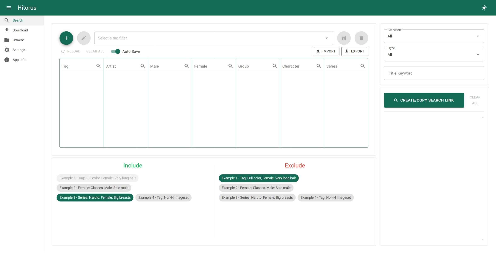

# Hitorus

<h1 align="center">
  <picture>
    <source media="(prefers-color-scheme: dark)" srcset="content/banner-dark.jpeg">
    <source media="(prefers-color-scheme: light)" srcset="content/banner-light.png">
    
  </picture>
</h1>

**다른 언어로 읽기:** [English](README.md), [한국어](README-ko.md)

Hitorus는 기존의 기능들을 확장시키고 앱만의 고유한 커스텀 기능들을 통해 hitomi.la를 더 사용하기 쉽게 만들어주는 데스크톱 웹 앱입니다.

## 미리보기

  

## 특징
- 커스터마이징 가능한 태그 필터로 검색 링크를 생성
- 갤러리 다운로드
- 더 향상된 UI와 기능들로 갤러리 감상

... 그 외에 더 많은 기능들!

## 설치
1. [가장 최근 버전](https://github.com/kaismic/Hitorus/releases/latest)을 다운로드 후 압축해제 하세요.
2. `Hitorus.Api.exe` (윈도우) 또는 `Hitorus.Api` (macOS/리눅스)을 실행하세요, 웹페이지가 자동으로 열립니다. 만약에 열리지 않으면, 브라우저에서 https://hitorus.pages.dev/ 을 여세요.

## [사용법](/wiki/ko/usage.md)
[사용법](/wiki/ko/usage.md) 문서를 참고하세요.

## 앱 데이터 관리
- 대부분의 앱 데이터는 `main.db` 파일에 저장됩니다. 데이터를 내보내거나 백업하려면, 이 파일을 저장한 후 새로운 위치에 붙여넣으세요.
- 만약에 호환되는 버전에서 새 버전으로 옮긴다면, 기존의 `main.db` 파일과 `Galleries` 폴더를 둘 다 옮길 수 있습니다.
- 만약에 호환되지 않는 버전에서 새 버전으로 옮긴다면, `main.db`는 호환되지 않으므로 `Galleries` 폴더만을 옮길 수 있습니다.

## 문제 해결
- 만약에 웹페이지가 로드되지 않는 경우, 시크릿 모드/사생활 보호 창으로 방문해 보세요.
- 드문 경우로, 다른 앱들이 기본 localhost 포트 번호를 사용중이라면 오류가 발생할 수 있습니다. 이 경우엔, `appsettings.json`에 있는 Url의 포트 번호를 (1024 - 65535) 중 랜덤한 번호로 바꾸세요.

      "Kestrel": {
        "Endpoints": {
          "Http": {
            "Url": "http://localhost:7076" <-- 여기
          }
        }
      },
      ...

## 참고
- 다운로드 된 갤러리 이미지들은 `Galleries` 폴더에 저장됩니다.
