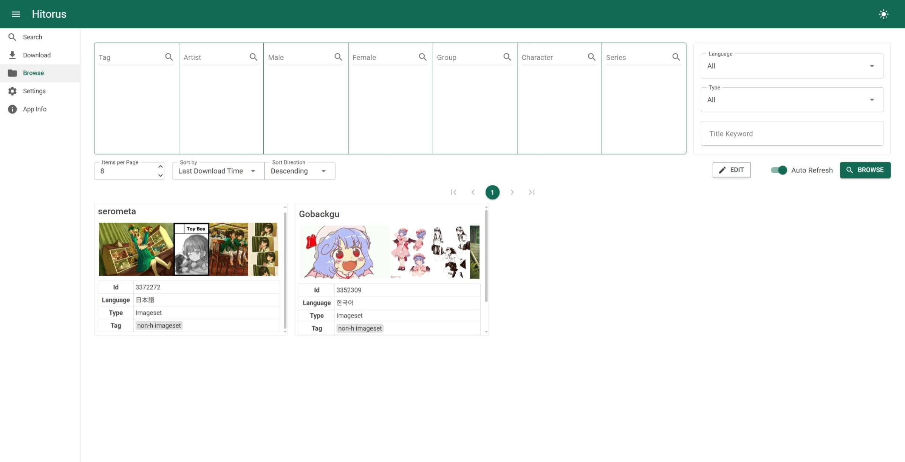

# Hitorus

<h1 align="center">
  <picture>
    <source media="(prefers-color-scheme: dark)" srcset="content/banner-dark.jpeg">
    <source media="(prefers-color-scheme: light)" srcset="content/banner-light.png">
    
  </picture>
</h1>

Hitorus is a local desktop web application designed to enhance the experience of using website hitomi.la. It offers the following features:

- Create search links with customizable tag filters
- Download galleries
- View galleries with enhanced functionalities

... and many more!

## Preview

  

## Installation
### Windows
1. Install **both** [ASP.NET Core Runtime and .NET Runtime](https://dotnet.microsoft.com/download/dotnet/9.0) (9.0.5 or higher) using the installers.
2. Run Powershell as administrator and run the following command: 

        Set-ExecutionPolicy -ExecutionPolicy RemoteSigned
3. Download the [latest release](https://github.com/kaismic/Hitorus/releases/latest) and extract it.

### macOS/Linux
1. Install **both** [ASP.NET Core Runtime and .NET Runtime](https://dotnet.microsoft.com/download/dotnet/9.0) (9.0.5 or higher). It is recommended to use the [offical installation script](https://learn.microsoft.com/en-us/dotnet/core/install/linux-scripted-manual#scripted-install) to install.
To download and use the installation script, run the following commands:

          wget https://dot.net/v1/dotnet-install.sh -O dotnet-install.sh
          ./dotnet-install.sh --channel 9.0 --runtime aspnetcore
          ./dotnet-install.sh --channel 9.0 --runtime dotnet

2. Add the installation location to `$PATH`. If you have used the installation script, you can do this by appending the following line to the end of `~/.bashrc` file:

        export PATH=$PATH:/home/{YOUR_USERNAME}/.dotnet
    where `{YOUR_USERNAME}` is your username.

3. Download the [latest release](https://github.com/kaismic/Hitorus/releases/latest) and extract it.

## Usage
### Windows
- Run `Hitorus-run.ps1`

### MacOS/Linux
- Run `Hitorus-run.sh`

## Known issues/How to resolve

## Other Information
- Downloaded gallery images are stored in the `Galleries` folder.
- The entire application data is stored in the `main.db` file (located under `Hitorus.Api`). To export or backup your data, copy, store it somewhere else and later paste it into the same location.