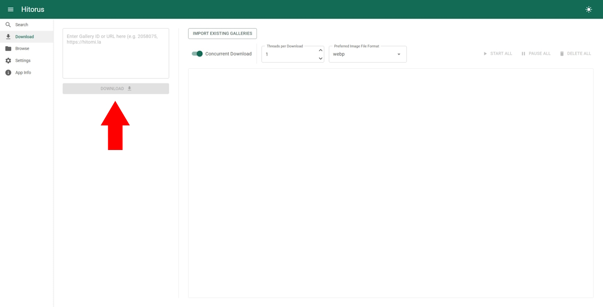

## Download
- Go to download page.

    

- To download a gallery, enter the URL or the gallery id and use the download button below. You can enter multiple URLs/ids separated by new lines.

    

- ### How to import existing galleries
    Put the folders containing gallery images into the `Galleries` folder. Then use the "Import existing galleries" button.

    

    For the imports to work:
    1. The folder must contain the gallery's id in its name (e.g. "some gallery name - 3817651", "185732" and "another 2811241 name" are all valid folder names.)
    2. The image files must be named in numbers starting with 1, with or without trailing 0s (e.g. "03.webp", "0001.avif" and "5.webp" are all valid image file names.)
