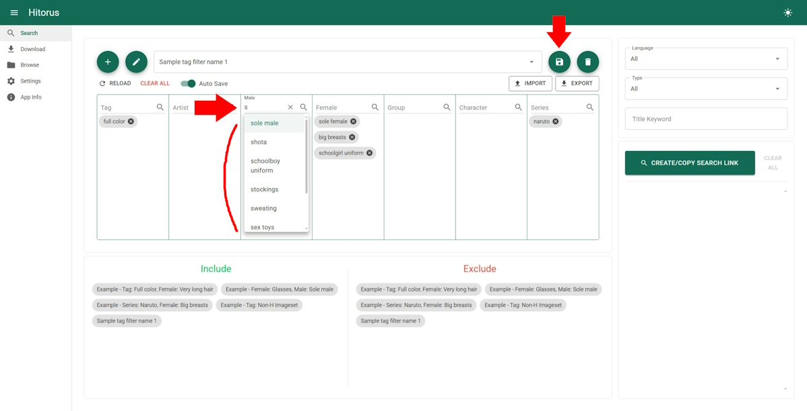
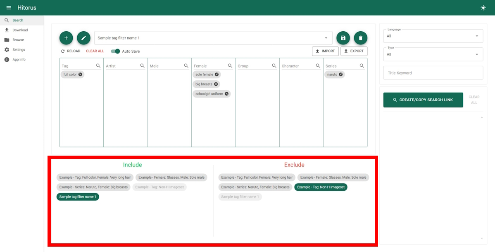
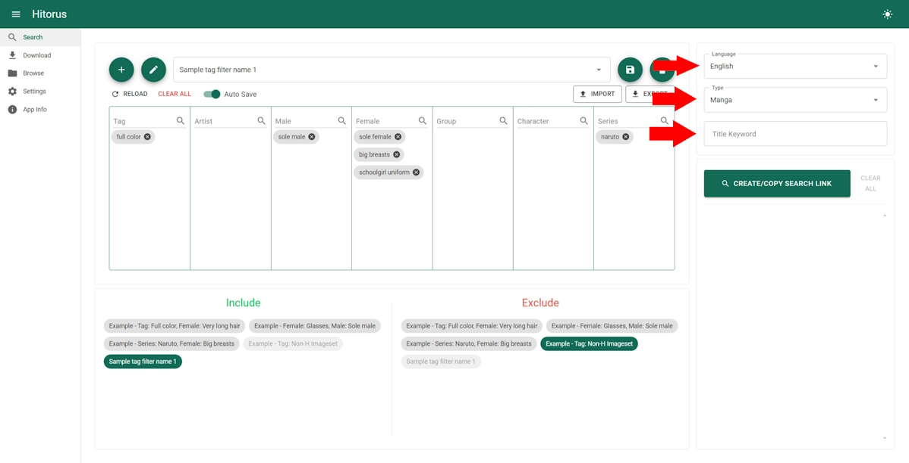

## 검색
1. 검색 페이지로 가세요.

    

2. 새로운 태그필터를 만드세요.

    
    

3. 사용할 태그들을 선택하고 태그필터를 저장하세요.

    

4. 검색 결과에 포함/제외할 태그필터들을 선택하세요.

    

5. 선택적으로 언어, 타입 또는 제목 키워드를 선택하세요.

    

6. 아래의 버튼을 클릭해서 검색 링크를 생성하고 생성된 검색 링크를 클릭해서 사용하세요.

    