# 사용법

**다른 언어로 읽기:** [English](usage.md), [한국어](usage-ko.md)

## 검색
1. 검색 페이지로 가세요.

    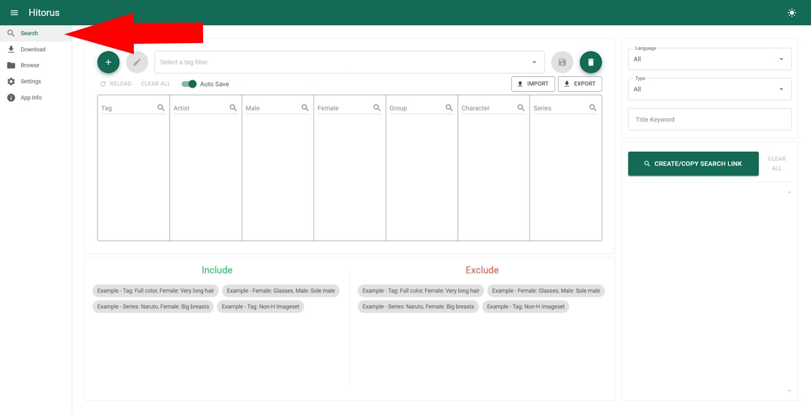

2. 새로운 태그필터를 만드세요.

    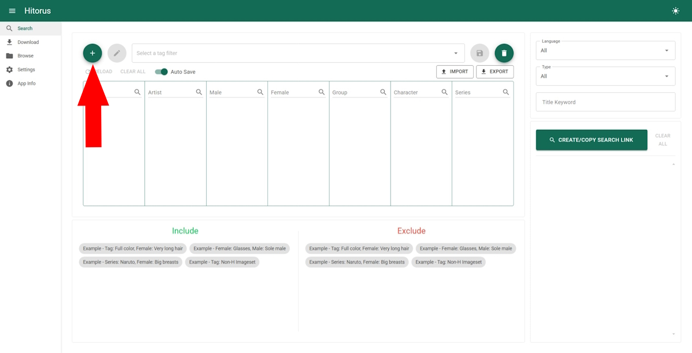
    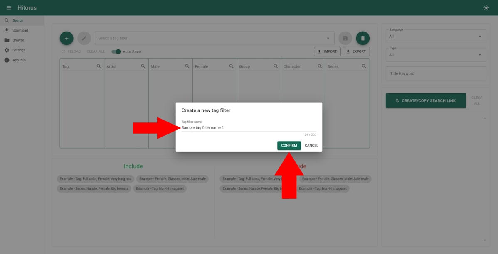

3. 사용할 태그들을 선택하고 태그필터를 저장하세요.

    

4. 검색 결과에 포함/제외할 태그들을 선택하세요.

    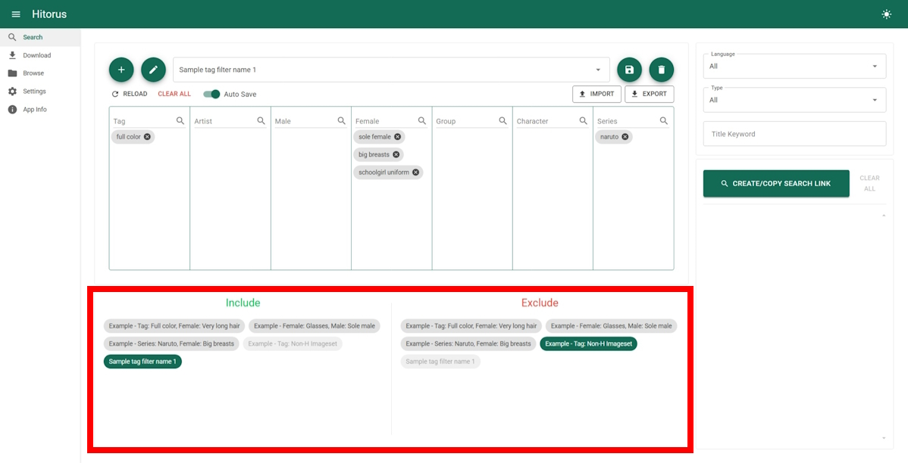

5. 선택적으로 언어, 타입 또는 제목 키워드를 선택하세요.

    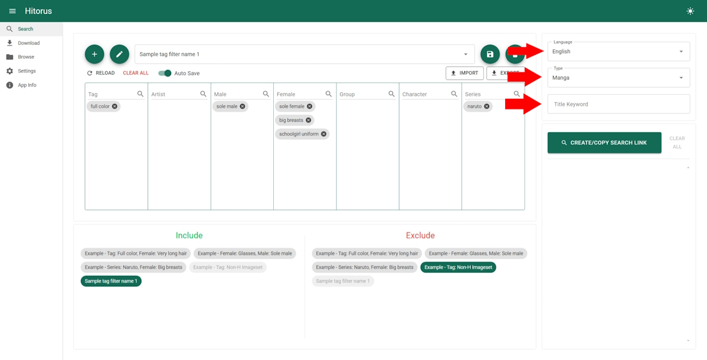

6. 아래의 버튼을 클릭해서 검색 링크를 생성하고 생성된 검색 링크를 클릭해서 사용하세요.

    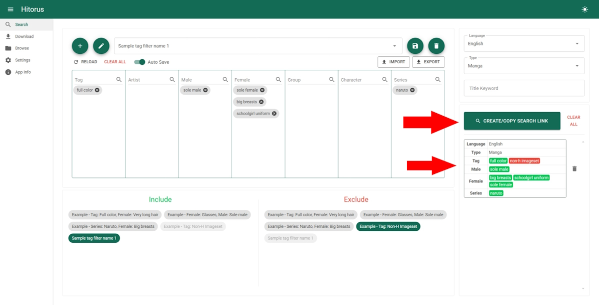

## 다운로드
- 다운로드 페이지로 가세요.

    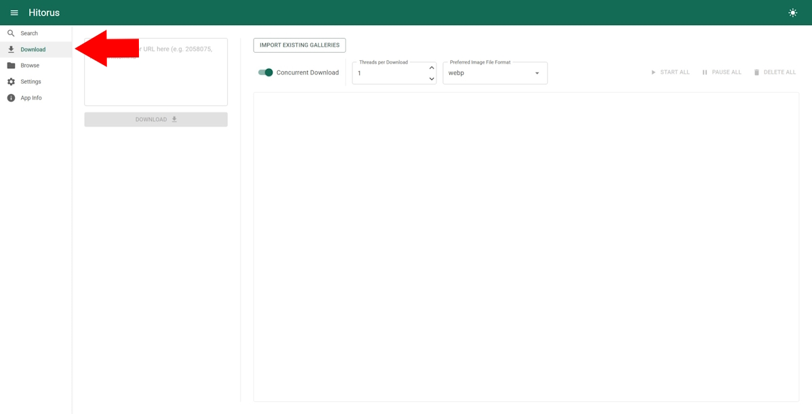

- 갤러리를 다운로드 하려면, URL 또는 갤러리 아이디를 입력한 후 아래의 다운로드 버튼을 사용하세요. 여러개의 URL 또는 아이디를 새 줄로 분리해서 입력할 수 있습니다.

    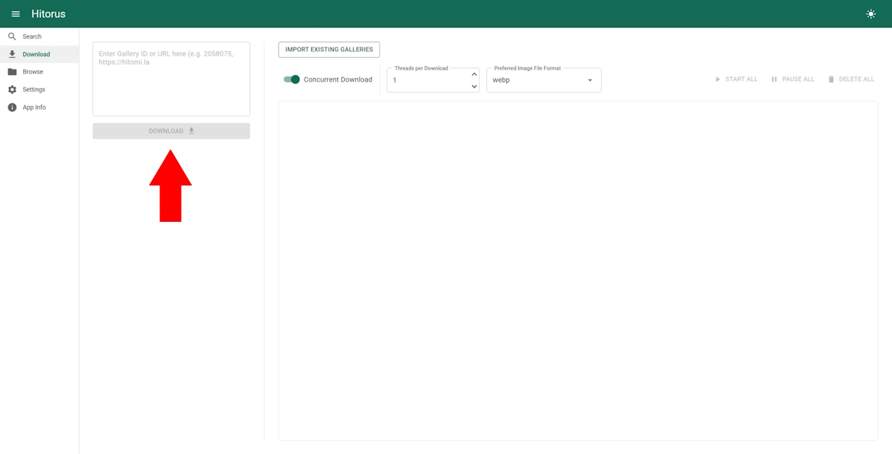

- ### 기존에 있던 갤러리를 불러오는 법
    갤러리 이미지들이 들어있는 폴더들을 `Galleries` 폴더에 넣으세요. 그 후 다운로드 페이지에서 "기존 갤러리 불러오기" 버튼을 사용하세요.

    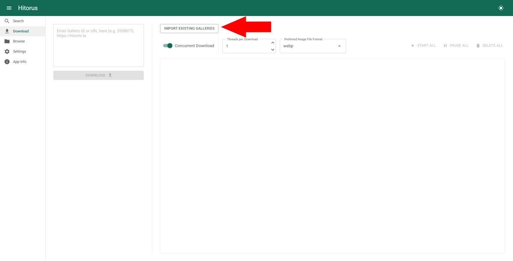

    불러오기가 작동하려면:
    1. 폴더 이름에 갤러리의 아이디가 포함되어야 합니다. (예시: "some gallery name - 3817651", "185732" 그리고 "another 2811241 name" 들은 모두 유효한 폴더 이름들입니다.)
    2. 이미지 파일들의 이름들은 1로 시작하는 번호여야 하고, 숫자 앞 0이 있는지는 무관합니다. (예시: "03.webp", "0001.avif" 그리고 "5.webp"들은 모두 유효한 이미지 파일 이름들입니다.)

## 찾아보기

여기서 다운로드 된 갤러리들을 찾아보거나 열 수 있습니다.

- 찾아보기 페이지로 가세요.

    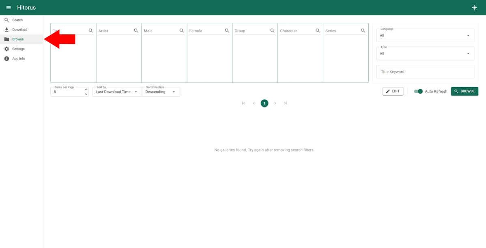

- 갤러리 이미지를 클릭해서 갤러리를 열고 감상하세요.

    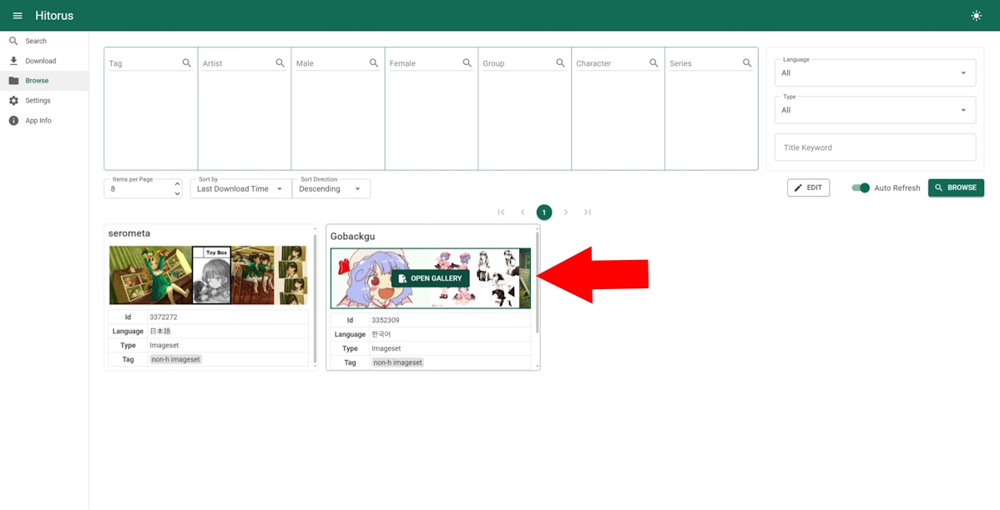

- 수정 버튼을 이용해 갤러리들을 선택한 후 삭제하세요.

    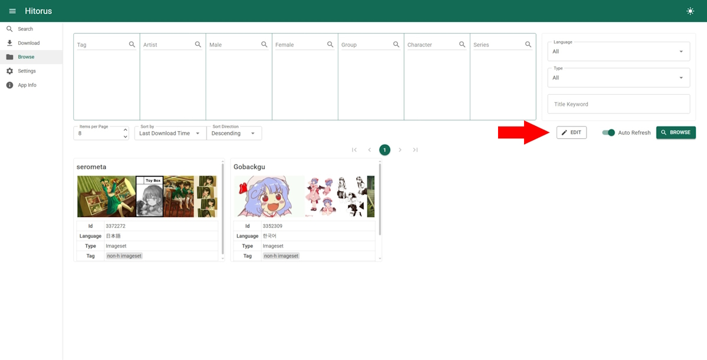
    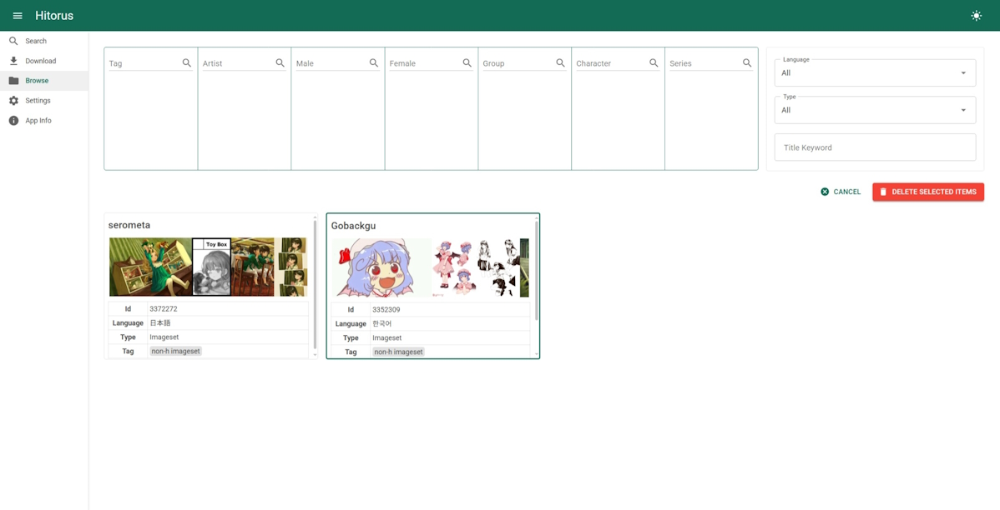