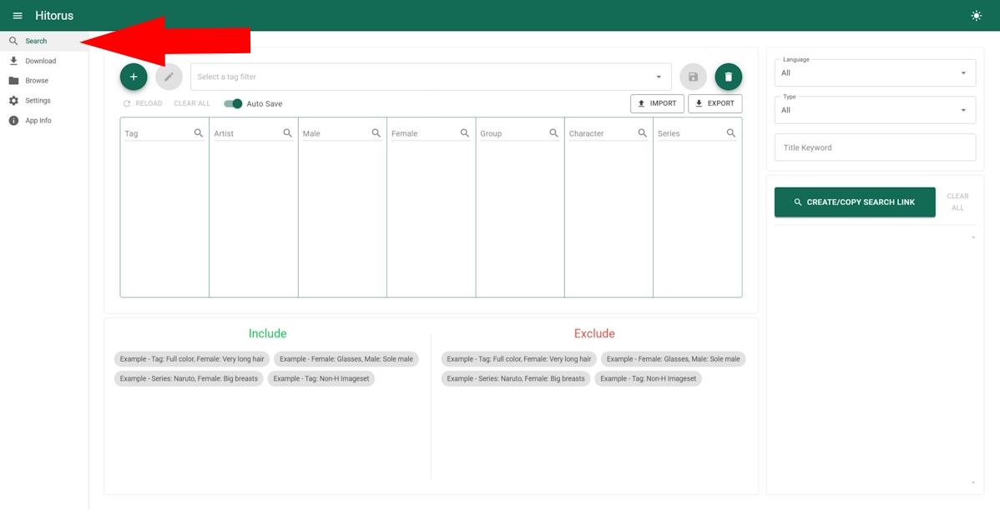
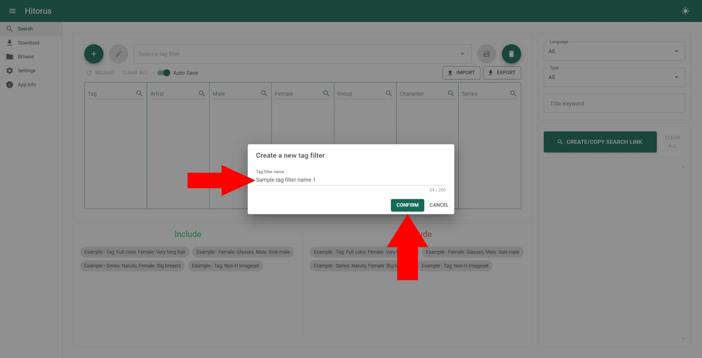
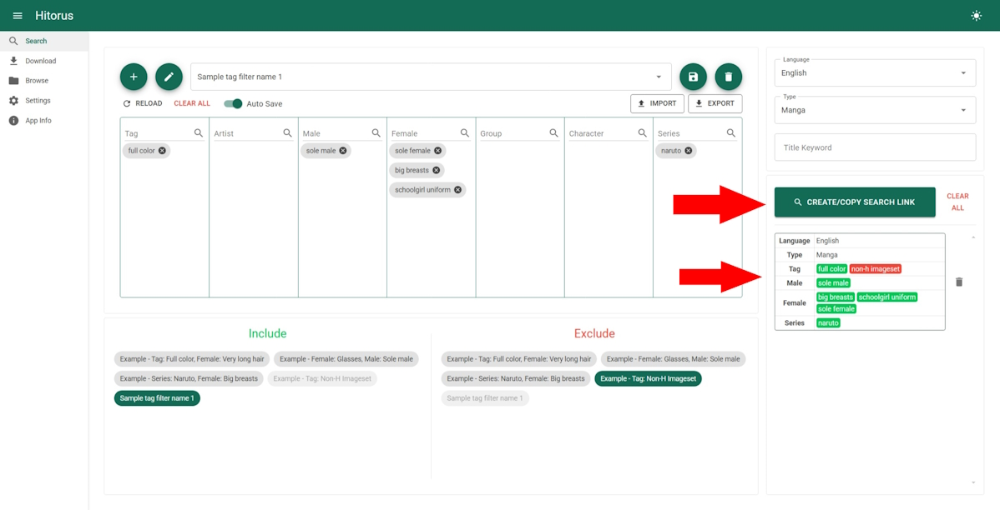
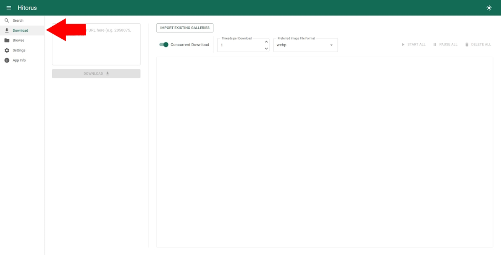

# Usage

**Read in other languages:** [English](usage.md), [한국어](usage-ko.md)

## Search
1. Go to search page.

    

2. Create a new tag filter.

    
    

3. Select tags to use and save the tag filter.

    

4. Select tag filters to include/exclude in the search results.

    

5. Optionally select a language, a type or a title keyword.

    

6. Click the button below to create search links and click on the created search links to use them.

    

## Download
- Go to download page.

    

- To download a gallery, enter the URL or the gallery id and use the download button below. You can enter multiple URLs/ids separated by new lines.

    

- ### How to import existing galleries
    Put the folders containing gallery images into the `Galleries` folder. Then use the "Import existing galleries" button.

    

    For the imports to work:
    1. The folder must contain the gallery's id in its name (e.g. "some gallery name - 3817651", "185732" and "another 2811241 name" are all valid folder names.)
    2. The image files must be named in numbers starting with 1, with or without trailing 0s (e.g. "03.webp", "0001.avif" and "5.webp" are all valid image file names.)

## Browse
You can browse and open the downloaded galleries here.

- Go to browse page

    

- Click on the gallery image to open and view galleries.

    

- Use the edit button to select and delete galleries.

    
    